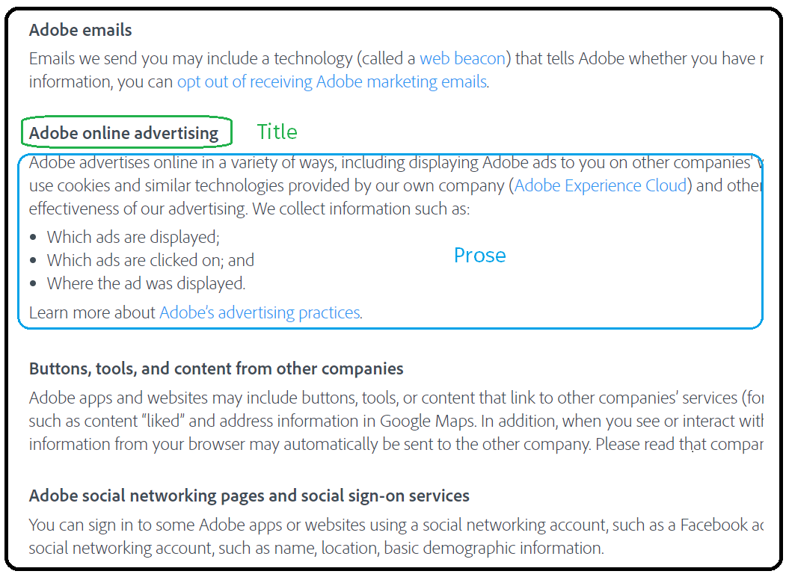
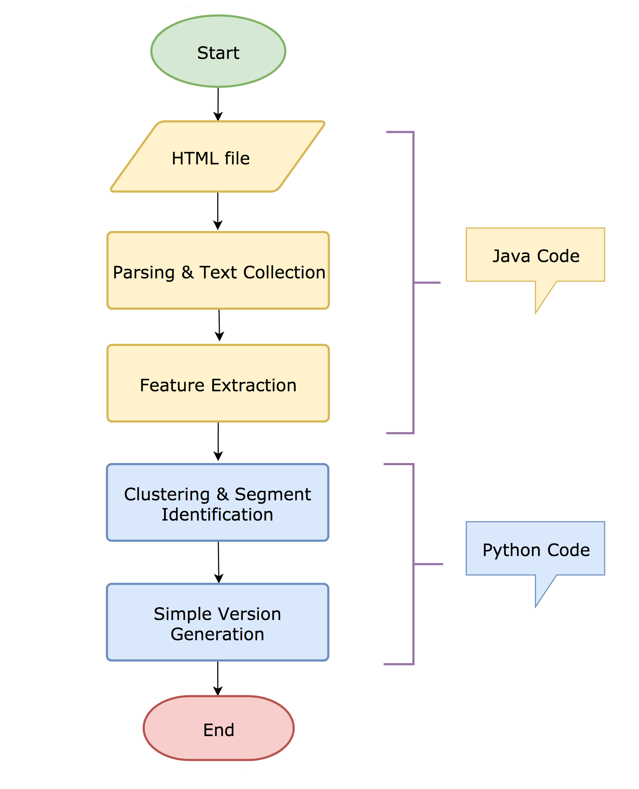
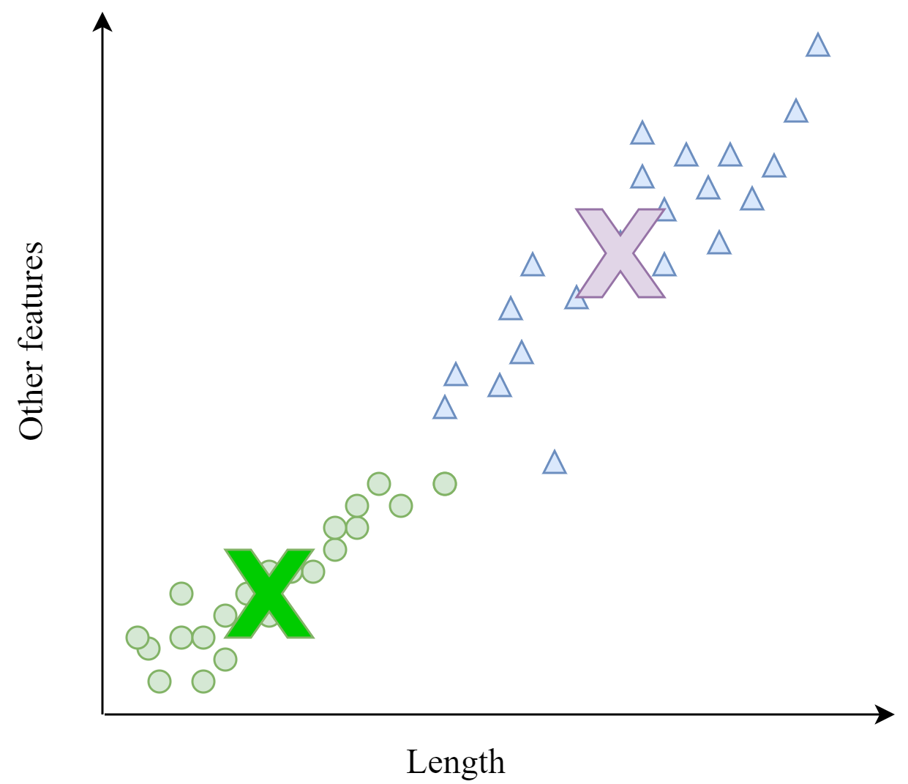
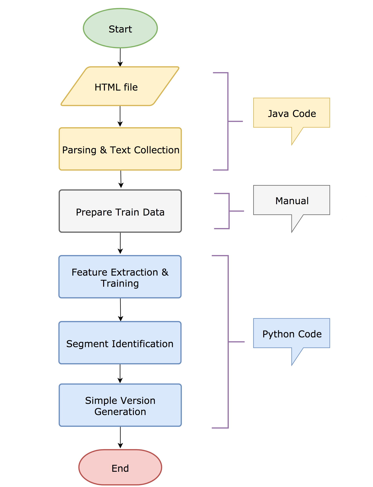
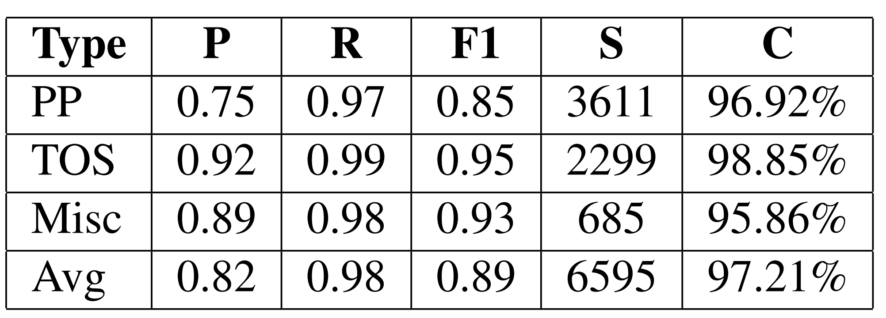

<h1> ASDUS </h1>

Automatic Segment Detection using Unsupervised and Supervised Learning is a system which is designed to detect title and prose segments in HTML documents. The following sections contain more information on ASDUS. Our <a href="https://github.com/abhijith-athreya/ASDUS/raw/master/pdf/supervised-unsupervised-methods.pdf" target="_blank">paper<a/> featuring ASDUS has been selected for presentation at the <a href="http://emnlp2018.org/" target="_blank">EMNLP</a> (Empirical Methods in Natural Language Processing) 2018 conference.

## What is the need for ASDUS?

HTML documents are one of the most sought-after data sources by researchers working in different areas. HTML pages are often organized into different segments based on the topicality of the text. Each section/segment is generally started with a short text, which we term as title and followed by a relatively more substantial portion of text, which we call as prose. The below figure (retrieved from ) shows this typical organization. The text is mined from HTML pages in many different ways, but existing methods do not take advantage of this specific organization.

HTML documents can be organized in many ways and creating a rule-based system to extract title and prose text will not yield good results. The segregation of title and prose text can be leveraged to improve:
*   Closed domain QA
*   Information retrieval
*   Summarization of web documents

## What does ASDUS do?

ASDUS uses natural language processing and machine learning techniques to automatically segregate a given web document into segments, which contain the corresponding title and prose text. The input for ASDUS is the raw HTML file, and it outputs a simplified version of the input HTML file, which contains all title text in "h2" tags and all prose text in "p" tags. This simple organization makes detection of title and prose text straightforward. Below is an image which has the original HTML file on the right and the output of ASDUS on the left. 

## How does ASDUS work?

ASDUS consists of two separate techniques:
*   Domain-Independent Method: This is solely based on unsupervised learning and does not require any training data.
*   Domain-Dependent Method: This uses supervised learning and requires prior labeled data for training.

### Domain-Independent Method

The below diagram depicts the various stages of this approach. This method has been developed using both Java and Python.

#### HTML file

The input for the Java program is the raw HTML file. 

#### Parsing & Text Collection

The input is parsed using Jsoup (https://jsoup.org/). During parsing, empty tags are removed. The output of the parsing stage is an orderly collection of tuples with XPath as the key and the text embedding between the tags as the value. 

#### Feature Extraction

To ensure segregation between title and prose text, a robust set of distinguishing features are required. The below features are extracted for each tuple:
*   own text length
*   next text length
*   number of punctuation symbols
*   number of sentences
*   number of stop words
*   number of discourse markers
*   number of named entity slots
*   number of words with capitalized first letter

All the features are self explanatory. ASDUS uses Stanford Core NLP toolkit to extract discourse markers and named entity slots. 

#### Clustering and Segment Identification

K-means clustering is performed over the features. Each data point corresponds to each tuple and two clusters are obtained (refer figure below). 

The first cluster which is the title cluster is closer to the origin and the second cluster, called the prose cluster is farther from the origin. Each textual segment of the tuple is classified into a title or prose using the k-means model. For all potential titles, an overlap score is calculated by measuring the word overlap between its words and the words from the next text segment. Based on experiments on a dev set, the overlap threshold was set to 75%. Titles with overlap scores exceeding the threshold and their corresponding XPaths are added to the list of probable title candidates.

#### Simple Version Generation

Each element in the final title list is marked with a custom attribute in the original HTML. To generate the simple version, a top down parse of the HTML is performed, wherein nodes with custom attribute (titles) are enclosed in "h2" tags and the text between two consecutive titles (prose) is enclosed in "p" tags. For the last segment, the prose text immediately following the title is added. For subsequent prose sections, a unigram overlap score similar to the one in the previous step is performed to avoid the addition of unrelated text. Legitimate textual content appearing before the first title is included in the final output under an uncategorized title.

### Domain-Dependent Method

The below diagram depicts the various stages of this approach. This method has been developed using both Java and Python. 

This method borrows the Parsing & Text Collection, Segment Identification, and Simple Version Generation stages from the domain-independent approach. Only the delta changes are explained below:

#### Prepare Train Data

To construct labeled data for training, we chose to use web privacy policies due to its lengthy nature, the presence of a reasonable number of segments, the presence of relatively similar content with varying HTML structure across websites and its importance to the general public. We annotated each HTML tag of 100 web privacy policies with one of the three labels: title, prose and unrelated.

#### Feature Extraction & Training

We built two word embedding models (using gensim), one using text from the titles and the other using prose texts. Then for text embedded in each HTML tag, we extracted these three features: 
*   t-score: Semantic relatedness score between title embedding and text in the tag
*   p-score: Semantic relatedness score between prose embedding and text in the tag
*   length

We used a feed forward neural network(h1=24, h2=48) with ReLu activation units and adagrad optimizer to train. 

## How well does it perform?

ASDUS is tested on a corpus of 303 web documents. This corpus is also available for download. The corpus consists of three different categories of web documents:
*   Privacy policies
*   Terms of service documents
*   Miscellaneous documents

Please refer the dataset documentation for more details. The domain-independent approach is tested on all the documents and the domain-dependent method is tested only on privacy policies. Below are the performance figures.

## Acknowledgement

ASDUS was built as part of the <a href="https://usableprivacy.org/">Usable Privacy Policy Project</a> and funded by the National Science Foundation under grant CNS-1330596.

